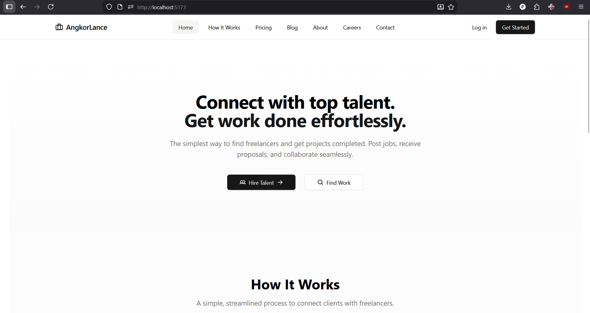
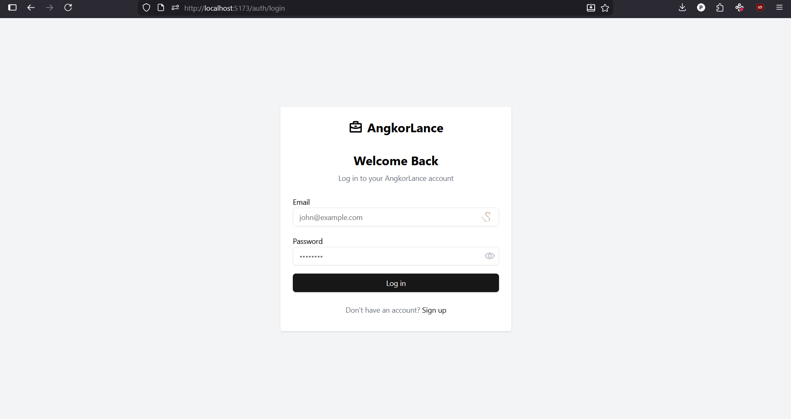
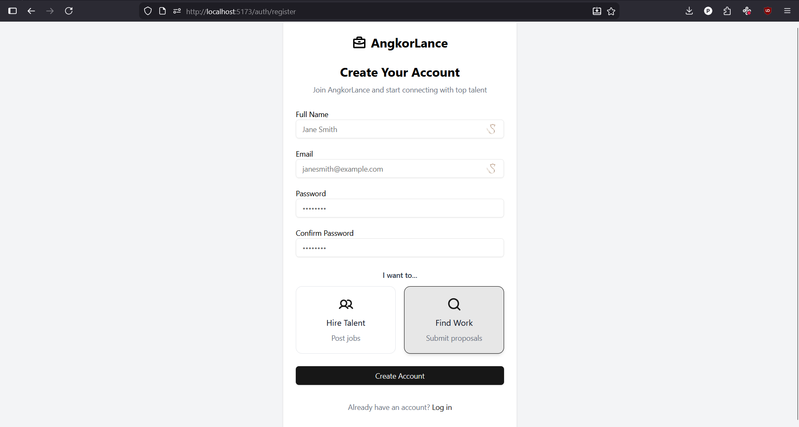
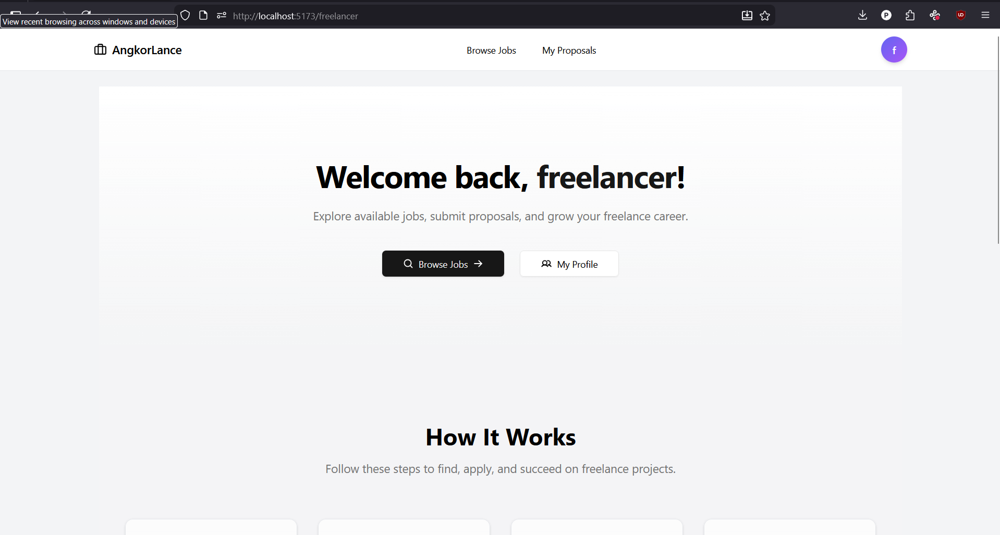
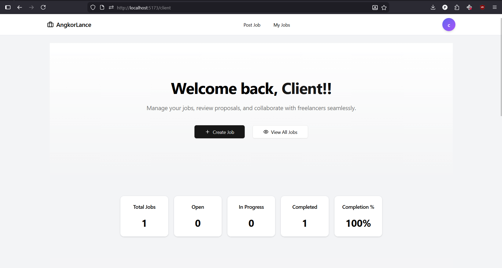

# AngkorLance Frontend


---

## 🌏 About The Project

**AngkorLance** is a modern freelancing marketplace platform designed to connect **clients** with **freelancers**.

The platform aims to make it easy for businesses to post jobs and for talented professionals to find work opportunities.

The concept is inspired by platforms such as **Upwork**, **Fiverr**, and **Freelancer.com**, but focuses on supporting freelancers and clients in Cambodia and Southeast Asia.

This repository contains the **frontend application** of the AngkorLance platform.

---

## ✨ Features

### Modern User Interface
Clean, responsive UI built for a smooth experience on both desktop and mobile devices.

### Role-Based Layout System
The application uses multiple layouts depending on user roles:

- Public Layout – Marketing pages
- Auth Layout – Login and authentication pages
- Freelancer Layout – Freelancer pages
- Client Layout – Client pages

### Public Pages

- Home
- How It Works
- Pricing
- Blog
- Careers
- Contact

### Authentication

- Login page
- Register page

---

## 🖼 Screenshots
### Public / Guest Pages
- **Landing Page**  


### Authentication
- **Login Page**  
  
- **Register Page**  


### Freelancer Pages
- **Freelancer Landing Page**  
  

### Client Pages
- **Client Landing Page**  


---

## ⚙️ Tech Stack

The frontend is built using modern technologies:

- **React**
- **Vite**
- **TypeScript**
- **Tailwind CSS**
- **React Router**

This stack enables fast development, modular architecture, and high performance.

---

## 🚀 Getting Started

### Clone the repository

```bash
git clone https://github.com/Panhavoan-Kymeas/AngkorLance.git
```

### Navigate into the project

```bash
cd AngkorLance
```

### Install dependencies

```bash
npm install
```

### Run the development server

```bash
npm run dev
```

### The application will start at:

```bash
http://localhost:5173
```

### 🔮 Future Features

  - Planned features for the full AngkorLance platform include:

  - Freelancer profiles and portfolios

  - Job posting system

  - Proposal and bidding system

  - Messaging between freelancers and clients

  - Payment and escrow system

  - Review and rating system

  - Admin dashboard
